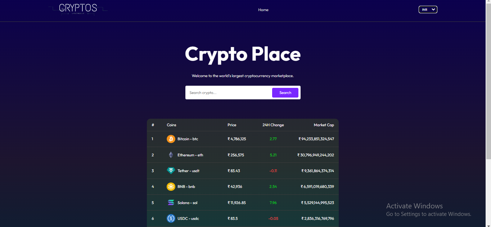

# Crypto Place

Crypto Place is a React-based web application that serves as a cryptocurrency marketplace. It displays real-time data for various cryptocurrencies, including their current prices, 24-hour change percentages, and market capitalization.



## Features

- **Cryptocurrency List:** Displays a list of top cryptocurrencies with their details.
- **Search Functionality:** Allows users to search for specific cryptocurrencies.
- **Real-time Data:** Fetches and displays the latest data for cryptocurrencies.

## Technologies Used

- **React:** For building the user interface.
- **ContextAPi ** For making API calls to fetch cryptocurrency data.
- **CSS:** For styling the application.

## Getting Started

Follow these instructions to get a copy of the project up and running on your local machine.

### Prerequisites

- Node.js installed on your machine.
- npm (Node package manager).

### Installation

1. **Clone the repository:**

    ```bash
    git clone https://github.com/yourusername/crypto-place.git
    ```

2. **Navigate to the project directory:**

    ```bash
    cd crypto-place
    ```

3. **Install the dependencies:**

    ```bash
    npm install
    ```

### Running the Application

1. **Start the development server:**

    ```bash
    npm run dev
    ```


## Code Overview

### File Structure


